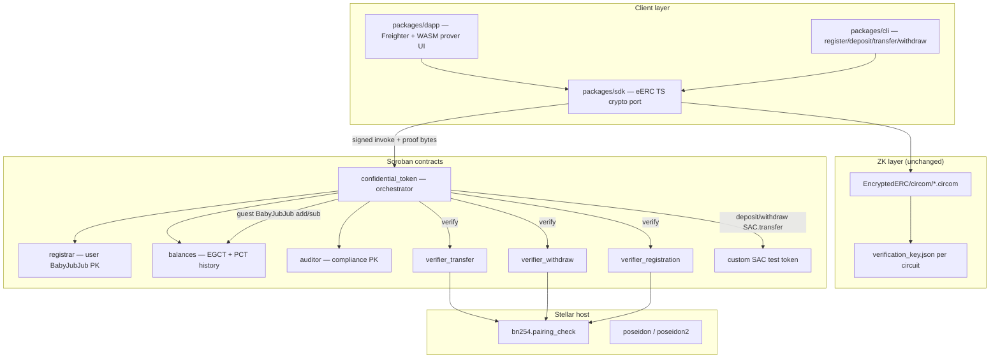
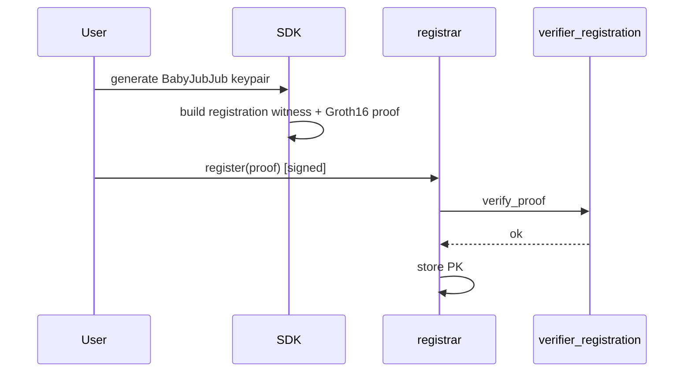
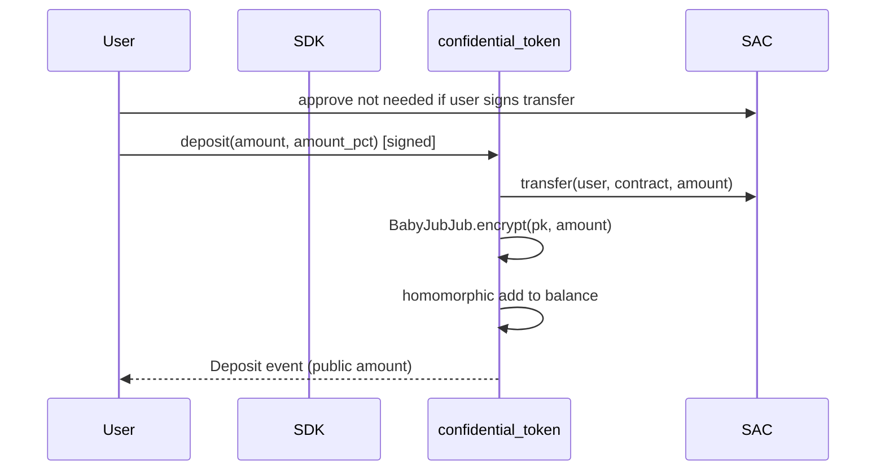
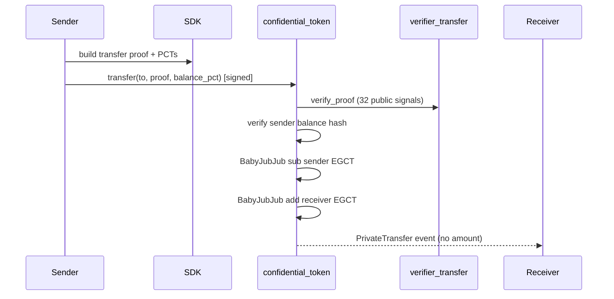
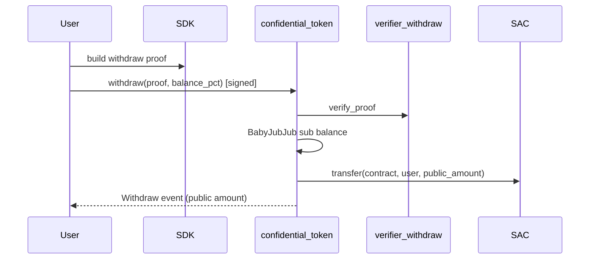

# Confidential Token on Stellar — Option A Architecture

## Goal and constraints

Build a **confidential fungible token** for the Stellar Hacks: Real-World ZK hackathon that:

- Hides **balances and transfer amounts**; keeps **sender/receiver addresses public** (Stellar confidential token model)
- Reuses the cloned **[EncryptedERC](EncryptedERC/)** Circom circuits, proof semantics, and TypeScript crypto client with minimal changes
- Ports on-chain **BabyJubJub Edwards arithmetic** to Soroban guest code (Option A)
- Uses Stellar **BN254 `pairing_check` host functions** for Groth16 verification (not for balance math)
- Operates in **converter mode only**: wrap a **custom SAC test token** (not mainnet USDC)
- Delivers **CLI scripts for dev/testing** and a **minimal web dApp** (Freighter + browser prover) for the demo video

**Explicitly out of scope for MVP:** standalone mint/burn mode, FHE/EIP-7984, encrypted metadata, privacy pools/ASP, BN254 G1 ElGamal redesign (Option B).

---

## Reference architecture



---

## Core architectural decisions

| Decision | Choice | Rationale |
|----------|--------|-----------|
| Crypto stack | BabyJubJub ElGamal + Poseidon PCT + Groth16 | Matches eERC; circuits/client reusable |
| On-chain curve ops | Guest Rust port of [BabyJubJub.sol](EncryptedERC/contracts/libraries/BabyJubJub.sol) | BN254 G1 host ops are a **different curve** — cannot substitute |
| Proof verification | Dedicated verifier contracts calling `env.crypto().bn254().pairing_check` | Native host; pattern from [soroban-examples/groth16_verifier](https://github.com/stellar/soroban-examples/tree/main/groth16_verifier) |
| Circuits in MVP | **Registration, Transfer, Withdraw** only | Deposit needs no ZK in eERC; mint/burn circuits deferred |
| Operation mode | Converter wrapping custom SAC | Simplest supply model; aligns with hackathon demo |
| Balance storage | Soroban **persistent storage** + TTL extension | Encrypted balances must survive archival |
| Auth model | Stellar `Address.require_auth()` on sender for transfer/withdraw | ZK proves crypto validity; Stellar auth proves account consent |
| Compliance | Auditor PCT in events (eERC pattern) | Matches Stellar selective-disclosure narrative |
| Fallback if budget exceeded | Option C for transfers only (new balance in public signals) | Documented escape hatch; not primary path |

---

## Soroban contract decomposition

Mirror eERC separation of concerns; one Wasm per contract to stay under 64 KB and enable independent verifier upgrades.

### 1. `registrar`

Port of [Registrar.sol](EncryptedERC/contracts/Registrar.sol).

- Stores `Address -> Point` (BabyJubJub public key, two `U256` limbs)
- `register(proof: RegisterProof)` — verify via `verifier_registration`, persist PK
- Prevents duplicate registration hashes
- **Storage:** persistent `(Address)` keys

### 2. `confidential_token` (main orchestrator)

Port of [EncryptedERC.sol](EncryptedERC/contracts/EncryptedERC.sol) converter paths only.

Public entrypoints:

| Function | Auth | ZK required | On-chain BabyJubJub |
|----------|------|-------------|---------------------|
| `register` | user | yes (delegates) | no |
| `deposit` | user | no | yes (`encrypt` with r=1) |
| `transfer` | sender | yes | yes (4 point add/sub) |
| `withdraw` | user | yes | yes (sub + SAC transfer out) |
| `set_auditor` | admin | no | no |

Cross-contract calls:
- SAC client: `transfer(from, contract, amount)` on deposit; `transfer(contract, user, amount)` on withdraw
- Verifier clients: `verify_proof(a, b, c, public_signals)`
- Registrar client: validate PK lookups

Events (confidential amounts omitted on private transfer):
- `Deposit { user, amount, token_id }` — public amount at boundary
- `Withdraw { user, amount, token_id, auditor_pct }` — public amount at boundary
- `PrivateTransfer { from, to, auditor_pct }` — no amount

### 3. `balances` (internal module or separate contract)

Port logic from [EncryptedUserBalances.sol](EncryptedERC/contracts/EncryptedUserBalances.sol).

- `EncryptedBalance` struct mirroring [Types.sol](EncryptedERC/contracts/types/Types.sol): `EGCT`, `nonce`, `transactionIndex`, `balancePCT`, `amountPCTs[]`, `balanceList` map
- `_add_to_user_balance` / `_subtract_from_user_balance` using guest `baby_jubjub::add/sub`
- Balance hash + nonce invalidation model unchanged
- **Storage:** persistent per `(user, token_id)`

### 4. `auditor`

Port of [AuditorManager.sol](EncryptedERC/contracts/auditor/AuditorManager.sol).

- Admin sets auditor Stellar `Address` + BabyJubJub PK
- Gate: all private ops require auditor configured

### 5. Verifier contracts (`verifier_registration`, `verifier_transfer`, `verifier_withdraw`)

- Embed verification keys from [EncryptedERC/circom/build/*/verification_key.json](EncryptedERC/circom/build/)
- Port pairing logic from generated [TransferCircuitGroth16Verifier.sol](EncryptedERC/contracts/verifiers/TransferCircuitGroth16Verifier.sol) to Rust using `soroban_sdk::crypto::bn254`
- One contract per circuit keeps Wasm small and mirrors eERC deploy pattern
- **Critical:** public signal count must match circuit (`5`, `32`, `16` respectively)

### 6. Custom SAC test token

- Issue classic asset via Stellar CLI (issuer + distributor accounts)
- SAC address is deterministic from `(asset_code, issuer)`
- Confidential token contract holds SAC balance as escrow during wrapped phase

---

## Guest crypto crate: `baby_jubjub`

New shared Rust library crate in the Soroban workspace.

**Source of truth:** [EncryptedERC/contracts/libraries/BabyJubJub.sol](EncryptedERC/contracts/libraries/BabyJubJub.sol)

Implement:

- Constants: `Q` (Fp), `A`, `D`, `R`, `BASE8` generator
- `Point { x: U256, y: U256 }`, `Egct { c1, c2 }`
- `add`, `sub`, `negate`, `double`, `scalar_mul`, `encrypt` (fixed r=1 for deposit path)
- `fp_mul`, `fp_add`, `fp_sub`, `fp_inv` (Fermat `a^(Q-2) mod Q` — no Stellar modexp precompile)

**Validation:** unit tests in native Rust comparing outputs to eERC [test/helpers.ts](EncryptedERC/test/helpers.ts) vectors (known add/sub/encrypt).

**Budget gate:** after implementation, simulate one `transfer` on testnet; if over resource limits, trigger Option C (circuit emits new EGCT as public output; contract stores instead of homomorphic update).

---

## Client layer

### `packages/sdk` (TypeScript)

Fork/adapt [EncryptedERC/src/](EncryptedERC/src/):

- `jub/jub.ts` — keygen, encrypt/decrypt (unchanged math)
- `poseidon/poseidon.ts` — PCT construction (unchanged)
- `prover/` — wrap existing Circom build artifacts; generate proofs for registration/transfer/withdraw
- `stellar/` — new module: build invoke args, serialize proof structs to Soroban `Bytes`, map `Address` instead of `0x...`

**KDF change:** eERC uses EIP-712 signature → private key. On Stellar, bind to `(network_passphrase, contract_id, user_address)` via SEP-53 or Ed25519 sign over structured message — document in SDK.

### `packages/cli`

Scripts mirroring eERC [test/helpers.ts](EncryptedERC/test/helpers.ts) flows:

1. Deploy all contracts + issue SAC
2. `register`
3. `deposit`
4. `transfer`
5. `withdraw`
6. `balance` (decrypt EGCT client-side)

Uses Stellar CLI + `@stellar/stellar-sdk` RPC simulate/send.

### `packages/dapp` (minimal demo UI)

- Freighter connect (testnet)
- Pages: Register, Deposit, Transfer, Withdraw, Balance decrypt
- Load Circom WASM prover in browser (reuse eERC zkit build or snarkjs)
- Show public addresses in tx; hide amounts in UI for private transfer step
- Link to Stellar explorer for contract IDs

---

## End-to-end flows

### Registration



### Deposit (wrap SAC — no ZK)



### Private transfer



### Withdraw (unwrap — ZK + public amount)



---

## Project structure

```
stellar-hackathon/
├── EncryptedERC/              # Reference only (circuits + TS crypto source)
├── confidential-token/        # NEW Soroban workspace
│   ├── Cargo.toml
│   ├── crates/
│   │   └── baby-jubjub/       # Shared guest crypto library
│   └── contracts/
│       ├── registrar/
│       ├── confidential-token/
│       ├── auditor/           # Can merge into main if size allows
│       ├── verifier-registration/
│       ├── verifier-transfer/
│       └── verifier-withdraw/
├── packages/
│   ├── sdk/                   # TS client + prover glue
│   ├── cli/                   # Dev/hackathon scripts
│   └── dapp/                  # Minimal Freighter demo (Vite/React)
├── circuits/                  # Symlink or copy EncryptedERC/circom + build artifacts
├── scripts/
│   ├── deploy-testnet.sh
│   └── issue-test-asset.sh
└── docs/
    └── architecture.md        # This document (post-approval)
```

---

## Data types (Soroban)

Mirror [Types.sol](EncryptedERC/contracts/types/Types.sol) as `#[contracttype]` structs:

- `Point`, `Egct`, `ProofPoints`, `RegisterProof`, `TransferProof`, `WithdrawProof`
- `AmountPct` (7 × U256 limbs + index)
- `EncryptedBalance` stored in persistent storage

Use typed `DataKey` enum for storage keys: `Balance(Address, u32)`, `BalanceHash(Address, u32, U256)`, `Admin`, `AuditorPk`, etc.

---

## Security and correctness rules

1. **Policy-and-proof split:** verifiers check crypto only; main contract enforces registration, auditor set, balance hash validity, SAC allowlist (single SAC address in instance storage).
2. **Auth:** `from.require_auth()` on transfer/withdraw/deposit; admin auth on `set_auditor`.
3. **Replay:** balance hash + nonce model from eERC preserved; proofs bind to current balance snapshot.
4. **SAC allowlist:** only configured SAC contract ID accepted — no arbitrary token parameter.
5. **TTL:** extend persistent TTL on every balance write.
6. **No secrets on-chain:** private keys and plaintext amounts never stored in contract storage.
7. **Simulation-first:** all CLI/dApp paths call RPC simulate before submit.

---

## Testing strategy

| Layer | Tests |
|-------|-------|
| `baby-jubjub` crate | Native Rust unit tests vs eERC vectors |
| Each contract | Soroban SDK unit tests with `mock_all_auths` |
| Integration | CLI happy path: register → deposit → transfer → withdraw → decrypt balance |
| Resource | `stellar contract invoke --sim-only` on transfer; record CPU/storage |
| Negative | Invalid proof, stale balance hash, unregistered user, insufficient SAC |

Reference eERC tests: [EncryptedERC-Converter.ts](EncryptedERC/test/EncryptedERC-Converter.ts), [helpers.ts](EncryptedERC/test/helpers.ts).

---

## Deployment topology (testnet)

1. Issue custom classic asset + fund distributor
2. Upload Wasm hashes (6 contracts)
3. Deploy verifiers with embedded VK constants
4. Deploy registrar (verifier address in constructor)
5. Deploy confidential_token (registrar, SAC, verifiers, admin, auditor)
6. Register CLI/dApp contract IDs in `packages/sdk/config/testnet.json`

---

## Hackathon deliverables checklist

- GitHub repo with README (architecture, threat notes, setup)
- Demo video: issue SAC → deposit → private transfer → withdraw → auditor PCT mention
- Working testnet deployment with contract IDs documented
- Clear statement: research prototype, not audited, testnet only

---

## Risk register and mitigations

| Risk | Mitigation |
|------|------------|
| Guest BabyJubJub exceeds Soroban CPU budget | Profile early; optimize `fp_inv`; fallback Option C for transfers |
| Wasm 64 KB limit | Split verifiers; aggressive `opt-level = "z"`; keep auditor in main or instance |
| Circom prover slow in browser | CLI for dev; pre-warm WASM in dApp; show loading state in demo |
| Trusted setup | Reuse eERC dev verification keys; document in README |
| Protocol version drift | Pin `soroban-sdk` to testnet protocol; verify CAP-0074/0075 on target network |

---

## Implementation phases

Phases are ordered by dependency; each phase produces a testable artifact.

**Phase 0 — Workspace bootstrap**
- `stellar contract init confidential-token` workspace
- Add `baby-jubjub` crate + native tests against eERC vectors

**Phase 1 — Verifiers**
- Port Groth16 verifier for registration circuit (smallest, 5 public inputs)
- Unit test with known valid/invalid proof bytes from eERC build

**Phase 2 — Registrar + auditor**
- Deploy registrar wired to registration verifier
- CLI register flow end-to-end

**Phase 3 — Main contract deposit path**
- Issue custom SAC; implement deposit with guest encrypt + SAC transfer
- CLI deposit + client-side balance decrypt

**Phase 4 — Transfer path**
- Deploy transfer verifier; implement full transfer with BabyJubJub add/sub
- Resource simulation gate; CLI private transfer

**Phase 5 — Withdraw path**
- Deploy withdraw verifier; SAC unwrap with public amount
- Full CLI round-trip

**Phase 6 — dApp demo**
- Freighter connect, four actions, explorer links
- Demo video recording

**Phase 7 — Documentation and submission**
- README, architecture doc, hackathon write-up aligning with DoraHacks confidential token idea
